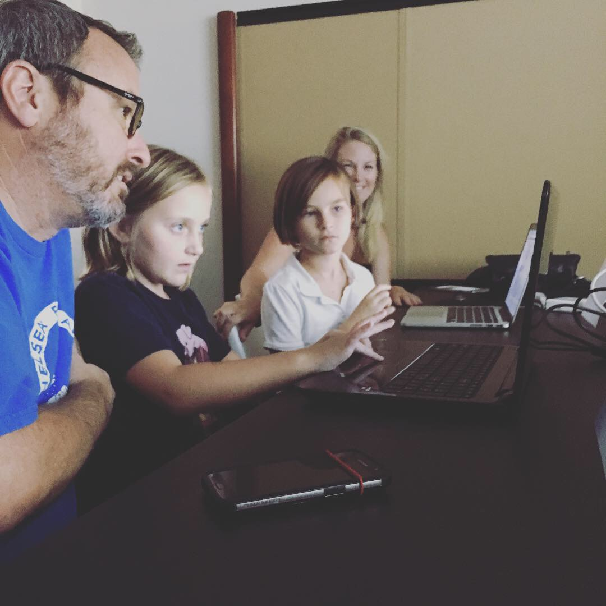

footer: Suncoast Developers Guild
build-lists: true
slide-transition: true

# [fit] Jason L Perry
## CEO @ Suncoast Developers Guild

---

# [fit] What is a   Software Developer?

---

# [fit] What does a developer do?

---

## [fit] Be Creative

---

## [fit] Build Things

---
[.background-color: #63CCCB]

---
[.background-color: #1F660E]

---
[.background-color: #ffffff]

---

## [fit] Solve Problems

---

# [fit] Who can be a developer?

^ Anybody. What skills make for a good software developer? I think curiosity is the most important skill.

---

# [fit] How do developers help us?

* Education
* Entertainment
* Communication

---

# [fit] What would you build?

^ If you could build any kind of program or app, what would you make?

---

